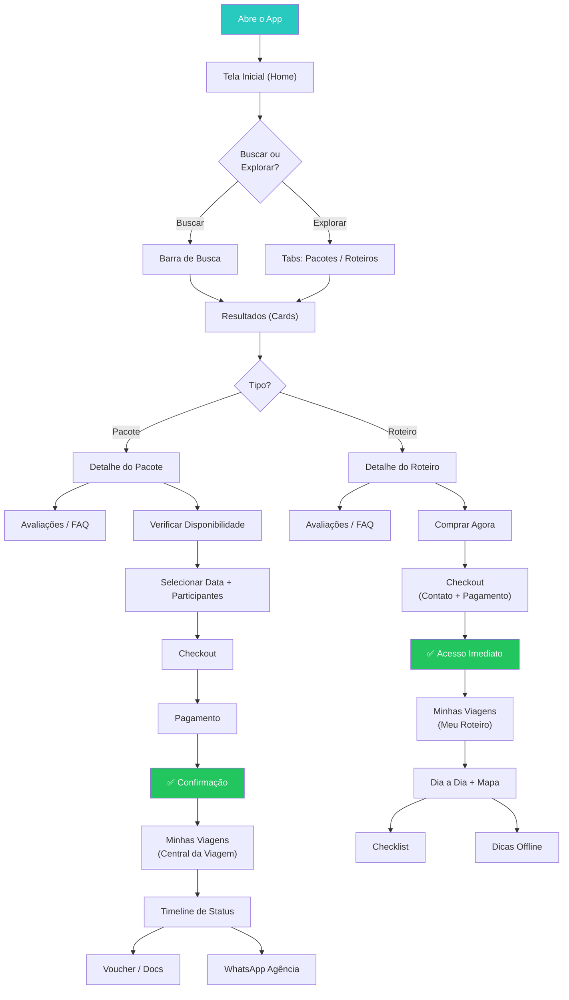
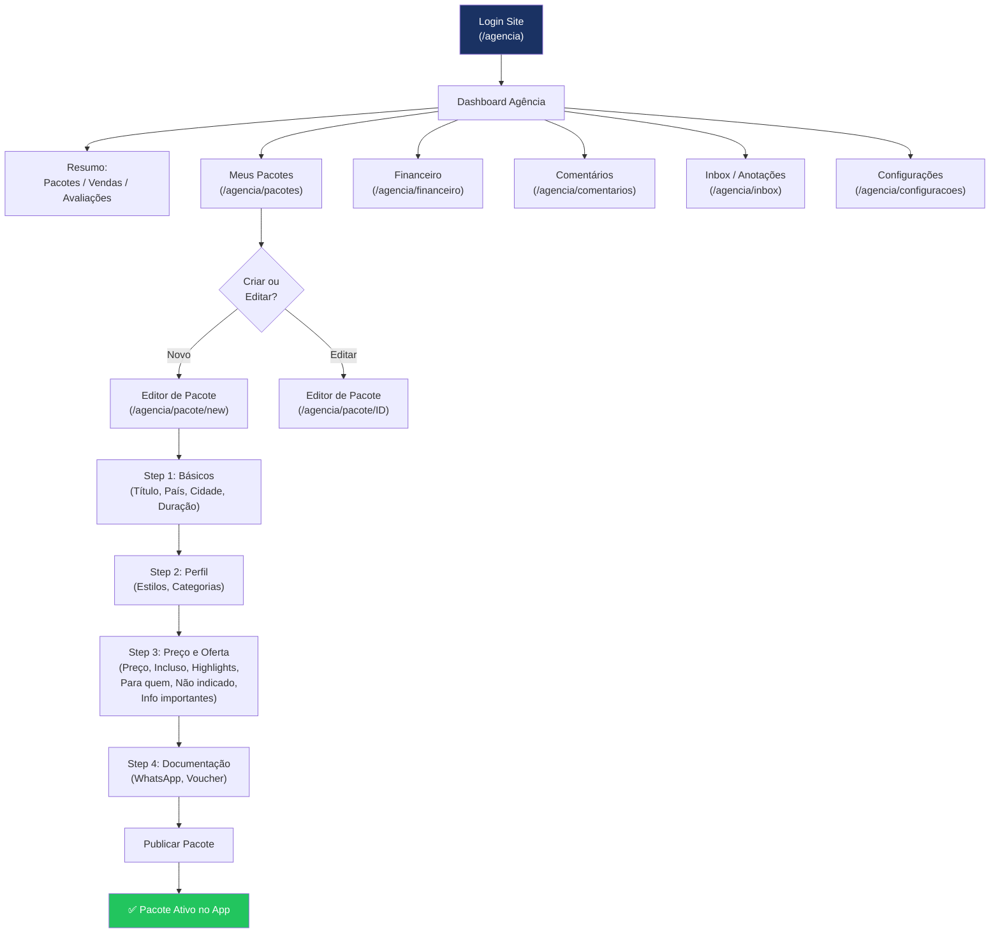
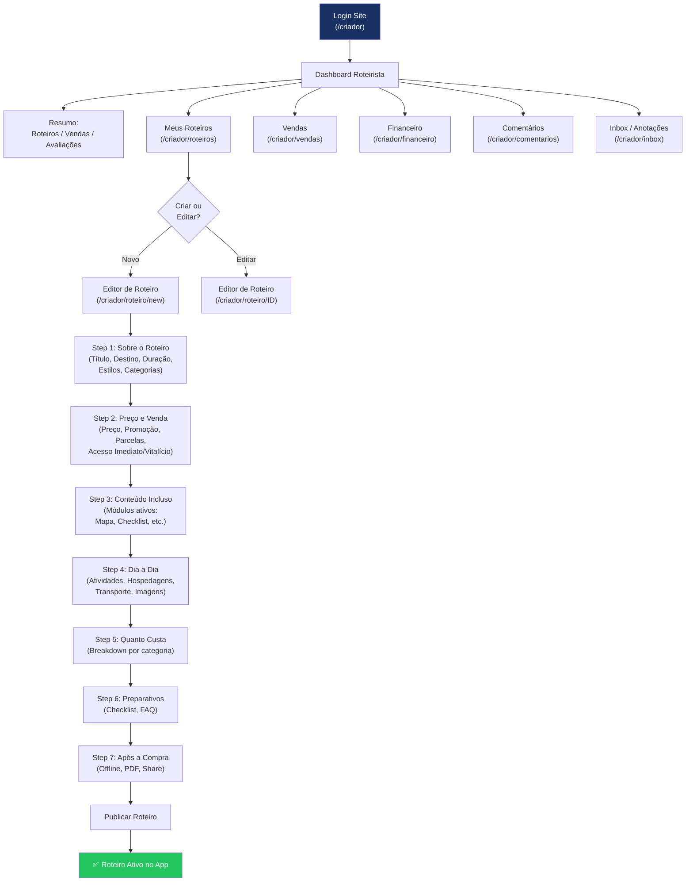

# Fluxograma VAMO — Jornadas de Usuário

## 🧳 Jornada do Cliente (Viajante)

```mermaid
flowchart TD
    A["Abre o App"] --> B["Tela Inicial (Home)"]
    B --> C{"Buscar ou\nExplorar?"}
    C -->|Buscar| D["Barra de Busca"]
    C -->|Explorar| E["Tabs: Pacotes / Roteiros"]
    D --> F["Resultados (Cards)"]
    E --> F
    F --> G{"Tipo?"}
    G -->|Pacote| H["Detalhe do Pacote"]
    G -->|Roteiro| I["Detalhe do Roteiro"]
    
    H --> H1["Avaliações / FAQ"]
    H --> H2["Verificar Disponibilidade"]
    H2 --> H3["Selecionar Data + Participantes"]
    H3 --> H4["Checkout"]
    H4 --> H5["Pagamento"]
    H5 --> H6["✅ Confirmação"]
    H6 --> H7["Minhas Viagens\n(Central da Viagem)"]
    
    I --> I1["Avaliações / FAQ"]
    I --> I2["Comprar Agora"]
    I2 --> I3["Checkout\n(Contato + Pagamento)"]
    I3 --> I4["✅ Acesso Imediato"]
    I4 --> I5["Minhas Viagens\n(Meu Roteiro)"]
    
    H7 --> J["Timeline de Status"]
    J --> J1["Voucher / Docs"]
    J --> J2["WhatsApp Agência"]
    
    I5 --> K["Dia a Dia + Mapa"]
    K --> K1["Checklist"]
    K --> K2["Dicas Offline"]

    style A fill:#28C9BF,color:#fff
    style H6 fill:#22c55e,color:#fff
    style I4 fill:#22c55e,color:#fff
```

---

## 🏢 Jornada da Agência

```mermaid
flowchart TD
    A["Login Site\n(/agencia)"] --> B["Dashboard Agência"]
    B --> C["Resumo:\nPacotes / Vendas / Avaliações"]
    
    B --> D["Meus Pacotes\n(/agencia/pacotes)"]
    D --> D1{"Criar ou\nEditar?"}
    D1 -->|Novo| E["Editor de Pacote\n(/agencia/pacote/new)"]
    D1 -->|Editar| F["Editor de Pacote\n(/agencia/pacote/ID)"]
    
    E --> G["Step 1: Básicos\n(Título, País, Cidade, Duração)"]
    G --> H["Step 2: Perfil\n(Estilos, Categorias)"]
    H --> I["Step 3: Preço e Oferta\n(Preço, Incluso, Highlights,\nPara quem, Não indicado,\nInfo importantes)"]
    I --> J["Step 4: Documentação\n(WhatsApp, Voucher)"]
    J --> K["Publicar Pacote"]
    K --> L["✅ Pacote Ativo no App"]
    
    B --> M["Financeiro\n(/agencia/financeiro)"]
    B --> N["Comentários\n(/agencia/comentarios)"]
    B --> O["Inbox / Anotações\n(/agencia/inbox)"]
    B --> P["Configurações\n(/agencia/configuracoes)"]

    style A fill:#1A3263,color:#fff
    style L fill:#22c55e,color:#fff
```

---

## ✍️ Jornada do Roteirista (Creator)

```mermaid
flowchart TD
    A["Login Site\n(/criador)"] --> B["Dashboard Roteirista"]
    B --> C["Resumo:\nRoteiros / Vendas / Avaliações"]
    
    B --> D["Meus Roteiros\n(/criador/roteiros)"]
    D --> D1{"Criar ou\nEditar?"}
    D1 -->|Novo| E["Editor de Roteiro\n(/criador/roteiro/new)"]
    D1 -->|Editar| F["Editor de Roteiro\n(/criador/roteiro/ID)"]
    
    E --> G["Step 1: Sobre o Roteiro\n(Título, Destino, Duração,\nEstilos, Categorias)"]
    G --> H["Step 2: Preço e Venda\n(Preço, Promoção, Parcelas,\nAcesso Imediato/Vitalício)"]
    H --> I["Step 3: Conteúdo Incluso\n(Módulos ativos:\nMapa, Checklist, etc.)"]
    I --> J["Step 4: Dia a Dia\n(Atividades, Hospedagens,\nTransporte, Imagens)"]
    J --> K["Step 5: Quanto Custa\n(Breakdown por categoria)"]
    K --> L["Step 6: Preparativos\n(Checklist, FAQ)"]
    L --> M["Step 7: Após a Compra\n(Offline, PDF, Share)"]
    M --> N["Publicar Roteiro"]
    N --> O["✅ Roteiro Ativo no App"]
    
    B --> P["Vendas\n(/criador/vendas)"]
    B --> Q["Financeiro\n(/criador/financeiro)"]
    B --> R["Comentários\n(/criador/comentarios)"]
    B --> S["Inbox / Anotações\n(/criador/inbox)"]

    style A fill:#1A3263,color:#fff
    style O fill:#22c55e,color:#fff
```
